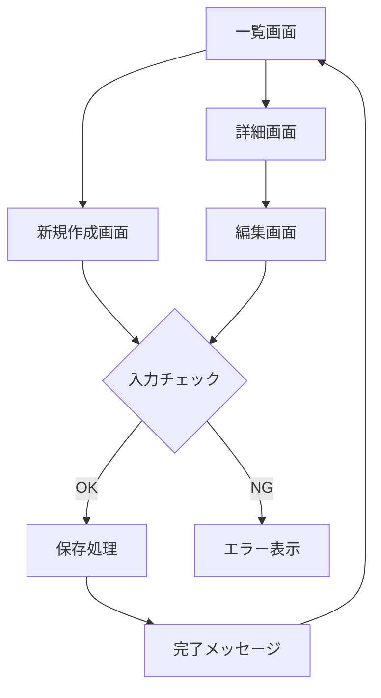

## 仕様書

  ユーザの開発指示と既存仕様を入力として、開発開始前に運用向けのシステム仕様を作成します。
  この工程で承認された仕様書を、以降の要件定義、設計、実装の基準とします。

### 出力ファイル

- プロジェクト直下の `.document` フォルダに、`仕様_差分_v{n}.{m}.md`、および `仕様_全体_v{n}.{m}.md` を作成する。
- `.document` フォルダが存在しない場合は、仕様書を作成する前に作成する。
- `.document` フォルダはGit管理対象とする。空フォルダとして保持する必要がある場合は、`.document/.gitkeep` を作成する。

### 作成手順

1. バージョン、およびリビジョンを新規作成するか、現状を修正するかは、事前に確認を取ること。
2. `仕様_差分_v{n}.{m}.md` に、前バージョンとの差分の仕様を記述すること（差分中心）。
3. `仕様_全体_v{n}.{m}.md` は、**必ず前バージョンの `仕様_全体_v{prev}.md` を全文コピーして作成**し、その上で今回差分を該当箇所へ追記・上書きすること（白紙から再構成しないこと）。
4. `仕様_全体_v{n}.{m}.md` に、システム全体の仕様を記述すること（差分要約にしない）。差分は `仕様_差分_v{n}.{m}.md` に集約し、全体仕様では「全体として読める形」で統合すること。
5. v2以降は v1 の構成を踏襲すること。v1 については作成前に必ず内容を提案すること。

### 禁止事項

- 仕様書はプロジェクト全体の仕様を扱うため、`仕様_差分_v{n}.{m}.md` と `仕様_全体_v{n}.{m}.md` を **コードファイル別のフォルダ**や**バージョン別成果物フォルダ**内に作成してはいけない。
- `仕様_全体_v{n}.{m}.md` を、差分要約（短縮版）として作成してはいけない。
- **省略禁止:** 前バージョンに存在する章・文章・表・例・注意点を削除してはいけない。削除が必要な場合は、章自体は残し「廃止」「削除理由」を明記すること。

### 差分仕様書の記載ルール

`仕様_差分_v{n}.{m}.md` には、変更対象ごとに次の内容を記載すること。

- 仕様ID
- 変更区分: `[ADD]`、`[MOD]`、`[DEL]`、`[KEEP]`
- 変更前の仕様
- 変更後の仕様
- 変更理由
- 影響範囲
- 対応する `仕様_全体_v{n}.{m}.md` の章または仕様ID

### 仕様IDと追跡性

- 機能、画面、入出力、データ、API、外部連携、エラーおよび受け入れ条件には、重複しない安定した仕様IDを付与すること。
- 既存仕様のIDは、内容を変更しても原則として維持すること。
- IDを変更または廃止する場合は、変更理由と旧IDとの対応を差分仕様書へ記載すること。
- 後続の要件定義書、設計書および最終確認から仕様IDを追跡できるようにすること。

### 未確定事項と設計事項

- 仕様作成中に判断できない事項は推測せず、「未確定」または「要確認」と記載すること。
- 手順2の仕様確認を完了するまでに、開発対象に関する未確定事項を解消すること。
- 実装方式、インデックス、テストファイル、具体的な内部配置などの設計事項は、仕様として決定済みの場合だけ確定事項として記載すること。
- 仕様作成時点で未決定の設計事項は「後続設計で決定」と明記し、仕様上の制約と混同しないこと。

### 仕様書の記載内容

`仕様_全体_v{n}.{m}.md` には、原則として以下の内容を記載すること。  
該当しない項目は削除せず、「該当なし」と明記すること。  
未確定の項目は推測で埋めず、「未確定」または「要確認」と明記すること。

#### 1. 概要

- システム名
- 対象機能
- 目的
- 背景
- 想定利用者
- 今回の変更概要

#### 2. 対象範囲・非対象範囲

- 今回対応する範囲
- 今回対応しない範囲
- 既存仕様として維持する範囲
- 将来対応予定がある場合の扱い

#### 3. 用語定義

- 業務用語
- 画面上の名称
- データ項目名
- 外部サービス名
- 略称

#### 4. 利用者・権限

- 利用者種別
- ロール
- 閲覧権限
- 登録権限
- 更新権限
- 削除権限
- 権限不足時の挙動

#### 5. 画面仕様

- 画面一覧
- 各画面の目的
- 表示項目
- 入力項目
- ボタン
- リンク
- 操作内容
- 初期表示
- 表示条件
- 非表示条件
- 活性条件
- 非活性条件
- 入力補助
- 確認ダイアログ
- 完了メッセージ
- エラーメッセージ

#### 6. 画面遷移

- 遷移元
- 遷移先
- 遷移条件
- 戻る操作
- キャンセル操作
- 保存後の遷移
- 削除後の遷移
- 認証切れ時の遷移
- 権限不足時の遷移

#### 7. 機能仕様

- 機能一覧
- 各機能の処理概要
- 正常系
- 異常系
- 境界条件
- 排他制御
- 二重送信対策
- 確認処理
- 登録処理
- 更新処理
- 削除処理
- 検索処理
- 一覧表示処理

#### 8. 入力仕様

- 入力項目
- 型
- 必須/任意
- 桁数
- フォーマット
- 初期値
- 入力制約
- バリデーション
- サニタイズ
- 入力エラー時の表示内容

#### 9. 出力仕様

- 画面表示
- ファイル出力
- 通知
- APIレスポンス
- ログ出力
- 出力項目
- 出力形式
- 出力タイミング

#### 10. データ仕様

- 使用テーブル
- 主なカラム
- 主キー
- 外部キー
- インデックス
- 作成タイミング
- 更新タイミング
- 削除タイミング
- 論理削除/物理削除
- データ保持期間

#### 11. API仕様

APIを使用しない場合は「該当なし」と明記すること。

- エンドポイント
- HTTPメソッド
- リクエスト
- レスポンス
- ステータスコード
- 認証要否
- 権限要否
- エラー形式
- 冪等性
- タイムアウト

#### 12. 外部連携仕様

外部連携がない場合は「該当なし」と明記すること。

- 連携先
- 連携方式
- 認証方式
- 送信データ
- 受信データ
- タイムアウト
- リトライ
- 失敗時の扱い
- 連携ログ

#### 13. フォルダ構成・ファイル構成

以下を明記すること。

- 配置先ディレクトリ
- 新規作成ファイル
- 変更対象ファイル
- 削除予定ファイル
- 設定ファイル
- 静的ファイル
- テストファイル
- 生成物の配置先
- 参照してよい既存ファイル
- 参照してはいけない旧ファイル、廃止ファイル、バックアップファイル

同名または類似名のファイルが複数存在する場合は、正式な配置先、仕様書のバージョン、Git履歴、更新日時の順に確認し、正式な対象ファイルを特定すること。  
更新日時だけで対象ファイルを決定してはいけない。正式な対象ファイルを判断できない場合は、実装を開始せずユーザに確認すること。

#### 14. セキュリティ仕様

- 認証
- 認可
- セッション管理
- CSRF対策
- XSS対策
- SQLインジェクション対策
- 入力値検証
- ファイルアップロード制限
- 秘密情報の管理
- 個人情報の管理
- ログに出してはいけない情報
- 権限不足時の挙動
- セキュリティ上の禁止事項

該当しない場合でも、以下のように明記すること。

```text
認証: 該当なし
認可: 該当なし
秘密情報: 取り扱いなし
個人情報: 取り扱いなし
ログ出力制限: 秘密情報・個人情報をログに出力しない
```

#### 15. 非機能仕様

- 性能要件
- 応答時間
- 同時利用
- 可用性
- 保守性
- 互換性
- ブラウザ対応
- モバイル対応
- アクセシビリティ
- 運用上の制約

#### 16. ログ仕様

- 出力ログ
- ログレベル
- 出力タイミング
- 出力項目
- 個人情報・秘密情報のマスク
- エラー時の調査に必要な情報
- ログに出してはいけない情報

#### 17. エラー・例外仕様

- 入力エラー
- 認証エラー
- 権限エラー
- データなし
- 排他エラー
- 外部連携エラー
- システムエラー
- ユーザ向けメッセージ
- 開発者向けログ
- 復旧方法

#### 18. Mermaid図

必要に応じて、Mermaid形式で図を記述すること。  
複数画面、複数処理、条件分岐、外部連携を含む場合は、原則としてMermaid図を作成すること。

作成対象の例:

- 画面遷移図
- 処理フロー図
- データフロー図
- 権限分岐図
- 外部連携図

例:



Mermaid図だけで仕様を完結させてはいけない。  
条件、項目、例外、エラー、ログについては文章または表でも記述すること。

#### 19. 受け入れ条件

- ユーザ操作単位の確認条件
- 正常系の完了条件
- 異常系の完了条件
- 権限確認条件
- 表示確認条件
- 入力チェック確認条件
- 回帰確認条件

#### 20. 未決事項・確認事項

- 未確定の仕様
- ユーザ確認が必要な事項
- 実装前に決めるべき事項
- 判断できない理由
- 確認が必要な相手または資料

#### 21. 変更履歴

- バージョン
- 変更日
- 変更内容
- 変更理由
- 影響範囲
